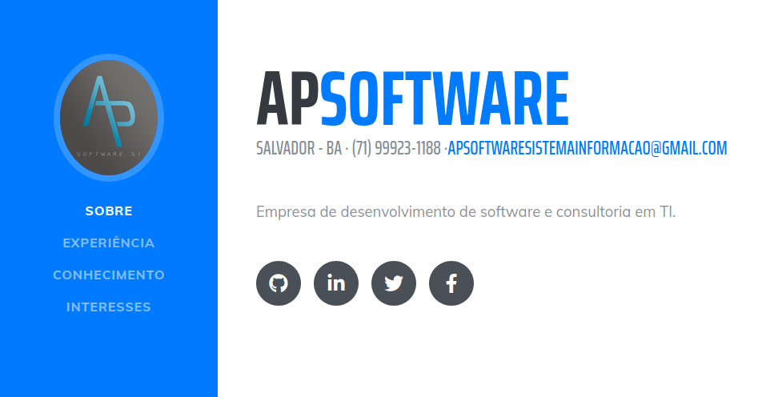

# portfolio-apsoftware

Gatsby.js V2 starter template based on Resume by startbootstrap (https://github.com/anubhavsrivastava/gatsby-starter-resume)

For an overview of the project structure please refer to the [Gatsby documentation - Building with Components](https://www.gatsbyjs.org/docs/building-with-components/).

Check online preview [here](https://anubhavsrivastava.github.io/gatsby-starter-resume/)

## Screenshot



## Install

Make sure that you have the Gatsby CLI program installed:

```sh
npm i -g gatsby-cli
```

And run from your CLI:

```sh
gatsby new <site-name> https://github.com/cpimenta-apsoftware/portfolio-apsoftware
```

Then you can run it by:

```sh
cd gatsby-example-site
yarn
yarn develop
```

### Personalization

Edit `config.js` to put up your details

```javascript
module.exports = {
  siteTitle: 'Portfólio APSoftware', // <title>
  ...
  firstName: 'AP',
  lastName: 'Software',
  // social
  socialLinks: [
    {
      icon: 'fa-github',
      name: 'Github',
      url: 'https://github.com/orgs/AP-Software-Sistemas-de-Informacao',
    }
    ...
  ],
};

```
#### Changing Theme Colour

To change theme colour, change `$primary` variable in `src/assets/sass/_variables.scss`.


### Deploying using Github page

`package.json` has a default script that uses `gh-pages` module to publish on Github pages. Simply running `npm run deploy` would publish the site on github pages.

Additionally, it also has [path-prefix](https://www.gatsbyjs.org/docs/path-prefix/) value set for gatsby config in `config.js`. Change `pathPrefix` to relevant path if your gatsby site is hosted on subpath of a domain, `https://theanubhav.com/somePath/`. If you are hosting it as root site, i.e, `https://theanubhav.com/` , remove the pathPrefix configuration.

### Checkout other similar starters

- [gatsby-starter-casual](https://github.com/anubhavsrivastava/gatsby-starter-casual)
- [gatsby-starter-grayscale](https://github.com/anubhavsrivastava/gatsby-starter-grayscale) 
- [gatsby-starter-spectral](https://github.com/anubhavsrivastava/gatsby-starter-spectral)
- [gatsby-starter-newage](https://github.com/anubhavsrivastava/gatsby-starter-newage)
- [gatsby-starter-stylish](https://github.com/anubhavsrivastava/gatsby-starter-stylish)
- [gatsby-starter-solidstate](https://github.com/anubhavsrivastava/gatsby-starter-solidstate)
- [gatsby-starter-readonly](https://github.com/anubhavsrivastava/gatsby-starter-readonly)
- [gatsby-starter-prologue](https://github.com/anubhavsrivastava/gatsby-starter-prologue)
- [gatsby-starter-phantom](https://github.com/anubhavsrivastava/gatsby-starter-phantom)
- [gatsby-starter-paradigmshift](https://github.com/anubhavsrivastava/gatsby-starter-paradigmshift)
- [gatsby-starter-overflow](https://github.com/anubhavsrivastava/gatsby-starter-overflow)
- [gatsby-starter-multiverse](https://github.com/anubhavsrivastava/gatsby-starter-multiverse)
- [gatsby-starter-identity](https://github.com/anubhavsrivastava/gatsby-starter-identity)
- [gatsby-starter-highlights](https://github.com/anubhavsrivastava/gatsby-starter-highlights)
- [gatsby-starter-fractal](https://github.com/anubhavsrivastava/gatsby-starter-fractal)
- [gatsby-starter-eventually](https://github.com/anubhavsrivastava/gatsby-starter-eventually)
- [gatsby-starter-directive](https://github.com/anubhavsrivastava/gatsby-starter-directive)
- [gatsby-starter-creative](https://github.com/anubhavsrivastava/gatsby-starter-creative)
- [gatsby-starter-aerial](https://github.com/anubhavsrivastava/gatsby-starter-aerial)

### Contribution

Suggestions and PRs are welcome!

Please create issue or open PR request for contribution.

### License

[](LICENSE)

refer `LICENSE` file in this repository.

### Orientações seguidas no evento DoWhile
1. Editar o config.js e componentizar o index.js
2. yarn add @weknow/react-bubble-chart-d3 para criação do gráfico de conhecimentos